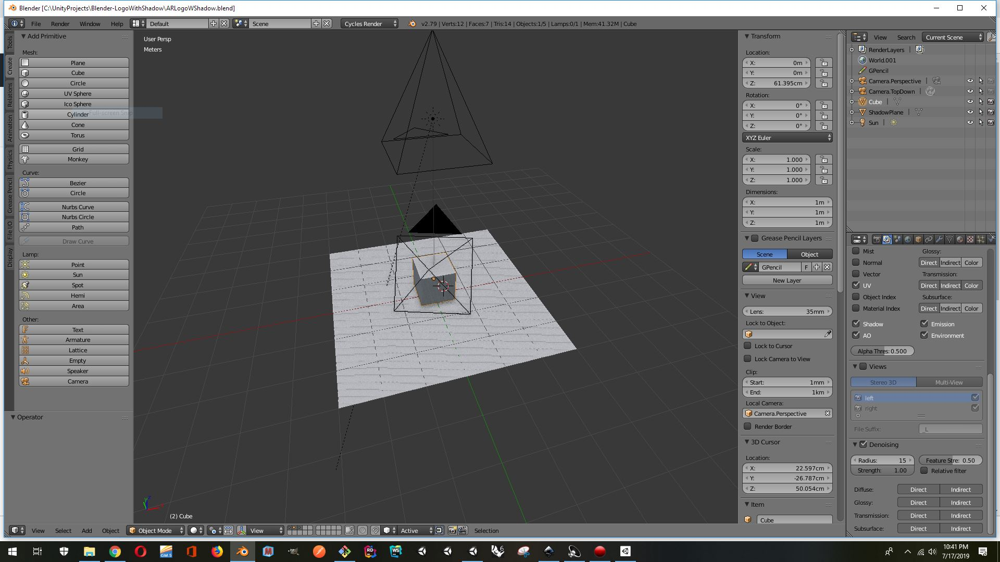

### **AR Logo With Shadow (Blender) file**

Blender Project file, that contains 2 cameras, and a plane which will act
 as a shadow catcher.. For the purposes of creating 3D logos with Ray traced
 shadows that can be used in an Augmented Reality project
 

